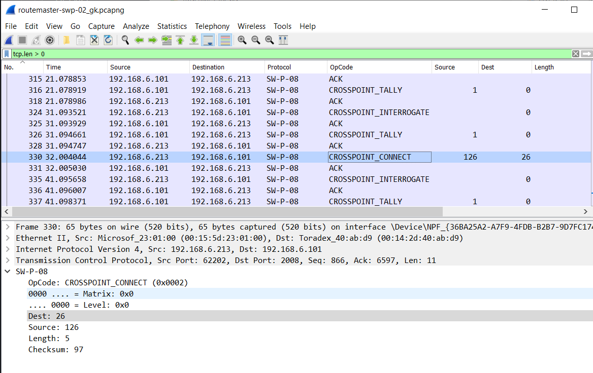

# Wireshark Lua dissectors for Video Routers

| Protocol            | Filename                     | Default port | Wireshark proto |
| ------------------- | ---------------------------- | ------------ | --------------- |
| Harris LRC          | `harris_lrc_dissector.lua`   | 52116        | LRC             |
| Nevion MRP          | `nevion_mrp_dissector.lua`   | 4381         | Nevion          |
| Pro-Bel SW-P-08     | `probel_swp08_dissector.lua` | 2007, 2008   | SWP08           |
| Pro-Bel SW-P-02     | `probel_swp02_dissector.lua` | 2006         | SWP02           |
| Quartz RCP          | `quartz_dissector.lua`       | 4000         | Quartz          |
| Utah RCP3-A         | `utah_rcp3a_dissector.lua`   | 5001         | RCP3A           |
| Grass Valley Native | `gvg_native_dissector.lua`   | 12345        | GVGNative       |
| NVision NP0017      | `np0017_dissector.lua`       | 9193         | NP0017          |

## Using the Dissectors

Either copy `xxx_dissector.lua` to your Wireshark plugins folder, or start wireshark (e.g. from Powershell) like this:

`& "c:\program files\wireshark\wireshark.exe" -X lua_script:harris_lrc_dissector.lua`

`& "c:\program files\wireshark\wireshark.exe" -X lua_script:nevion_mrp_dissector.lua`

`& "c:\program files\wireshark\wireshark.exe" -X lua_script:probel_swp08_dissector.lua`

`& "c:\program files\wireshark\wireshark.exe" -X lua_script:probel_swp02_dissector.lua`

`& "c:\program files\wireshark\wireshark.exe" -X lua_script:quartz_dissector.lua`

`& "c:\program files\wireshark\wireshark.exe" -X lua_script:utah_rcp3a_dissector.lua`

`& "c:\program files\wireshark\wireshark.exe" -X lua_script:gvg_native_dissector.lua`

`& "c:\program files\wireshark\wireshark.exe" -X lua_script:np0017_dissector.lua`

If your router is using a different TCP port you can use wireshark's "Decode As.." function to specify the port and protocol.

Packet contents for the all common routing commands are decoded.

